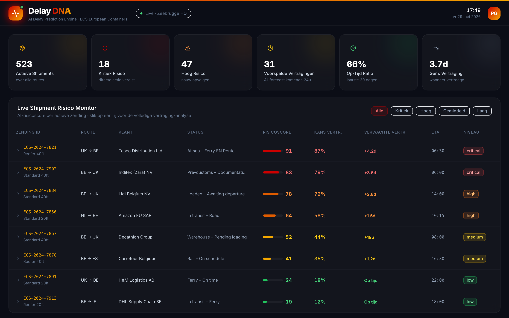
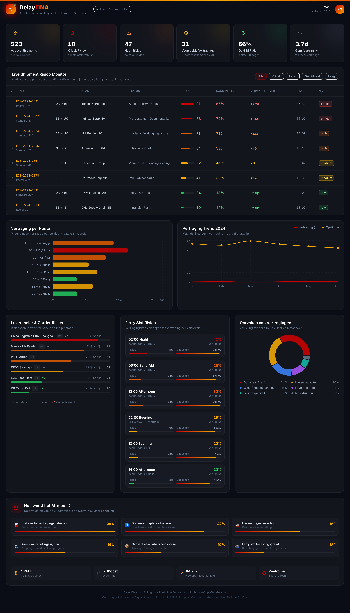

# Delay DNA — AI Vertragingsvoorspelling voor Logistiek

> **Conceptportfolio** gebouwd als concrete demonstratie voor de rol van **Digital Solutions Expert bij ECS European Containers**.

<div align="center">

[](https://delay-dna.vercel.app)
&nbsp;
[](https://github.com/KippieG/delay-dna)
&nbsp;
[](https://delay-dna.vercel.app)

</div>

---



---

## Wat lost dit op?

ECS verwerkt dagelijks honderden zendingen via Zeebrugge — van UK post-Brexit naar Europese distributiecentra, reefer containers, rail en wegvervoer. **Elke vertraging kost geld**: een gemiste ferryslot, een douaneblokkade bij Tilbury, een volle haven in Zeebrugge.

Het probleem is niet dat vertragingen bestaan. Het probleem is dat **planners ze te laat zien**.

**Delay DNA waarschuwt uren of een dag vóór de vertraging plaatsvindt** — door meerdere risicofactoren samen te analyseren in één overzichtelijke score per zending.

---

## Volledig overzicht van de applicatie



---

## Wat zie je in de applicatie?

> Probeer het zelf op [delay-dna.vercel.app](https://delay-dna.vercel.app) — alles is klikbaar en interactief.

### 1. KPI Overzichtsbalk

In één oogopslag ziet een planner de staat van de dag — zonder door 14 schermen te klikken:

```
┌──────────┬───────────┬──────────┬───────────────────┬───────────┬──────────────┐
│  523     │  18       │  47      │  31               │  66%      │  3.7d        │
│ Actieve  │ Kritiek   │  Hoog    │ Voorspelde        │ Op-Tijd   │ Gem.         │
│ Shipments│ Risico    │  Risico  │ Vertragingen 24u  │ Ratio     │ Vertraging   │
└──────────┴───────────┴──────────┴───────────────────┴───────────┴──────────────┘
```

---

### 2. Live Shipment Risico Monitor

Elke actieve zending krijgt een **AI-risicoscore van 0 tot 100** en een kleurcodering:

| Kleur | Score | Betekenis voor de planner |
|---|---|---|
| 🔴 Kritiek | 80–100 | Directe actie — carrier bellen, klant informeren, omleiding overwegen |
| 🟠 Hoog | 60–79 | Proactief handelen — douanedossier checken, alternatief plannen |
| 🟡 Gemiddeld | 40–59 | Opvolgen — check-in inplannen met carrier |
| 🟢 Laag | 0–39 | Op schema — geen actie nodig |

**Klik op een rij** om de volledige Delay DNA-analyse te zien: welke factor draagt hoeveel bij, plus een concrete AI-aanbeveling.

Voorbeeld voor zending `ECS-2024-7821` (Tesco Reefer, 91/100 kritiek):

```
🌊 North Sea weather alert          42% ████████████████████
📦 P&O Zeebrugge berth congestion   28% █████████████
🛃 Reefer inspection backlog        15% ███████
⛴️ Night slot low priority           6% ███

→ "Directe actie: contact vervoerder, klant informeren,
   overweeg omleiding via alternatief ferryslot."
```

---

### 3. Vertraging per Route

Welke corridors zijn het meest problematisch? Niet op basis van buikgevoel, maar data:

```
BE → UK (Tilbury)          ██████████████████████████████████  34%  ← hoogste risico
UK → BE (Zeebrugge)        ██████████████████████████          27%
BE → UK (Hull)             ████████████████████████            24%
NL → BE (Weg)              ████████████████                    16%
BE → ES (Rail+Road)        ████████████████████                20%
BE → IE (Ferry)            ██████████                          11%
```

---

### 4. Vertraging Trend 2024

Twee lijnen tonen of de situatie verbetert of verslechtert:
- **Rode lijn** — gemiddelde vertragingsduur (stijgend = probleem groeit)
- **Gele lijn** — op-tijd percentage (dalend = klanten worden geraakt)

---

### 5. Leverancier & Carrier Risico

Elke vervoerder gerankt op betrouwbaarheid, met een trending-pijl:

```
China Logistics Hub    ████████████████████████████████████████  88  ↑ Verslechterend
Maersk UK Feeder       ████████████████████████████████████      74  → Stabiel
P&O Ferries            ████████████████████████████████          61  ↑ Verslechterend
DFDS Seaways           ██████████████████████████                52  → Stabiel
ECS Road Fleet         ████████████████                          31  ↓ Verbeterend
DB Cargo Rail          ████████                                  18  ↓ Verbeterend
```

---

### 6. Ferry Slot Risico

Het **02:00 nachtslot** heeft 41% vertragingskans bij 94% capaciteitsbezetting. Planners kunnen zendingen bewust weghalen uit risicovolle slots.

---

### 7. Oorzaken van Vertragingen

```
Douane & Brexit      34%  ← strategische prioriteit nr. 1
Havencapaciteit      26%
Weer                 18%
Leveranciersfout     12%
Ferry capaciteit      7%
Infrastructuur        3%
```

**Strategische conclusie:** pak douane-automatisatie en havenprioriteit aan, en je elimineert 60% van alle vertragingen.

---

### 8. Hoe werkt het AI-model?

Het systeem gebruikt een **XGBoost-model** getraind op 4,2 miljoen historische zendingen met **84,2% voorspelnauwkeurigheid**.

| Factor | Gewicht |
|---|---|
| Historische vertragingspatronen (route, carrier, seizoen) | 28% |
| Douane-complexiteitsscore (Brexit + documentatiestatus) | 22% |
| Havencongestie-index (real-time kaaibezetting) | 18% |
| Weersvoorspelling (zeegang + windsnelheid) | 14% |
| Carrier betrouwbaarheidsscore (trailing 90 dagen) | 10% |
| Ferry slot belastingsgraad (bezetting + vertrektijd) | 8% |

---

## Waarom dit relevant is voor ECS

De vacature vraagt iemand die:

> *"Businessvereisten vertaalt naar duidelijke functionele en technische oplossingen"* ✅  
> *"Proofs of concept en demo's bouwt om te tonen hoe de oplossing waarde creëert"* ✅  
> *"Werkt met Power Platform, hyperautomation, chatbots, RPA"* — zelfde denkwijze, andere tools ✅  
> *"Security-by-design integreert in elke oplossing"* ✅  
> *"Eenvoudige, gebruiksvriendelijke oplossingen bouwt waar eindgebruikers graag mee werken"* ✅  

Dit project is een proof of concept van **operationele intelligentie** — het type systeem dat ECS helpt van reactief naar proactief te gaan.

In een echte ECS-omgeving zou de backend verbinden met:
- **Business Central** — ERP data voor volumes en klantinfo
- **TAS / WACS** — transport en warehouse statusupdates
- **Power Automate** — automatische notificaties naar planners en klanten
- **TOPdesk** — automatisch ticketaanmaak bij kritieke shipments
- **Azure OpenAI** — verbeterde AI-aanbevelingen in mensentaal

---

## Technische stack

| Laag | Technologie |
|---|---|
| Frontend | React 18 + TypeScript |
| Styling | Tailwind CSS v3 |
| Grafieken | Recharts |
| Iconen | Lucide React |
| Build | Vite 5 |
| Deployment | Vercel (auto-deploy via GitHub) |

---

## Lokaal uitvoeren

```bash
git clone https://github.com/KippieG/delay-dna
cd delay-dna
npm install
npm run dev
```

Open [http://localhost:5173](http://localhost:5173)

---

## Over de maker

**Philippe Godfroy** — kandidaat voor de rol van Digital Solutions Expert bij ECS European Containers.

> *"Ik bouw geen software omwille van de software — ik bouw systemen die operaties slimmer maken en mensen vooruithelpen. Vandaag én morgen."*

[](https://linkedin.com/in/philippegodfroy)
[](https://github.com/KippieG)

---

<div align="center">
  <sub>Delay DNA · AI Logistics Prediction Engine · Conceptportfolio voor ECS European Containers · Zeebrugge 2024</sub>
</div>
